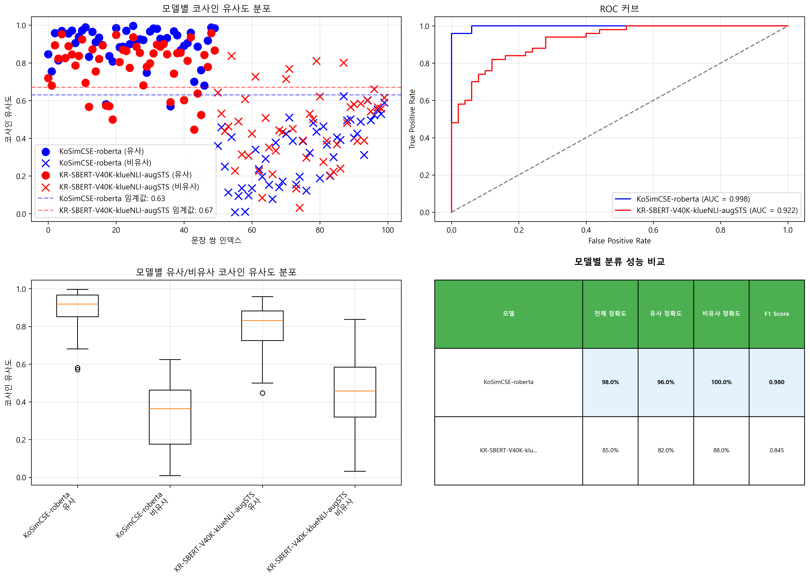

# 🇰🇷 Korean Sentence Embedding Comparison

한국어 문장 임베딩 모델들의 성능을 비교하고 시각화하는 프로젝트입니다.

## 📋 Overview

이 프로젝트는 두 가지 주요 한국어 sentence embedding 모델의 성능을 비교합니다:

- **[BM-K/KoSimCSE-roberta](https://huggingface.co/BM-K/KoSimCSE-roberta)**: Contrastive Learning 기반 한국어 문장 임베딩 모델
- **[snunlp/KR-SBERT-V40K-klueNLI-augSTS](https://huggingface.co/snunlp/KR-SBERT-V40K-klueNLI-augSTS)**: SBERT 기반 한국어 문장 임베딩 모델

## 🚀 Features

- 유사/비유사 문장 쌍에 대한 코사인 유사도 계산
- ROC 커브 및 AUC 스코어를 통한 성능 평가
- 최적 임계값 자동 탐색
- 다양한 시각화 (분포도, Box plot, Scatter plot)
- 종합적인 벤치마크 제공

## 📁 Project Structure

```
korean-sentence-embedding-example/
│
├── compare_models.py     # 종합적인 성능 비교 및 시각화
├── quiz.csv             # 테스트용 문장 쌍 데이터셋
├── model_comparison.png  # 모델 비교 시각화 결과
└── README.md            # 프로젝트 문서
```

## 🛠️ Installation

```bash
# 필요한 패키지 설치
pip install torch transformers scikit-learn matplotlib seaborn numpy
```

## 📊 Usage

### 종합적인 성능 비교
100개 문장 쌍을 사용한 상세 분석:

```bash
python compare_models.py
```

생성되는 결과:
- 콘솔에 각 문장 쌍의 유사도 점수 출력
- `model_comparison.png` 파일로 시각화 결과 저장
- AUC, 정확도, 최적 임계값 등 성능 지표 출력

### 테스트 데이터 관리
`quiz.csv` 파일에서 테스트 데이터를 관리:
- CSV 형식: `문장1,문장2,정답`
- 정답: 1 (유사), 0 (비유사)
- 기본 제공: 유사 50개, 비유사 50개 (총 100개)

## 📈 Performance Metrics

### 평가 지표
- **AUC (Area Under Curve)**: ROC 커브 아래 면적
- **Accuracy**: 최적 임계값에서의 분류 정확도
- **Optimal Threshold**: 최고 정확도를 달성하는 임계값

### 테스트 데이터셋
- **유사 문장 쌍**: 50개 (의미적으로 유사한 한국어 문장들)
- **비유사 문장 쌍**: 50개 (의미적으로 다른 한국어 문장들)
- **총 100개의 문장 쌍**을 사용하여 더 신뢰할 수 있는 평가 수행

### 데이터 커스터마이징
`quiz.csv` 파일을 수정하여 자신만의 테스트 데이터셋 구성 가능:
```csv
문장1,문장2,정답
영화를 보는 것을 좋아한다,영화 감상을 즐긴다,1
날씨가 좋다,비가 많이 온다,0
```

## 📸 Visualization

생성되는 시각화 결과물:

1. **유사도 분포**: 각 모델의 유사/비유사 문장 쌍에 대한 코사인 유사도 분포
2. **ROC 커브**: 모델별 True Positive Rate vs False Positive Rate
3. **Box Plot**: 유사/비유사 그룹별 코사인 유사도 분포 비교
4. **성능 지표 테이블**: 모델별 전체 정확도, 클래스별 정확도, F1 Score 비교



## 🔍 Key Findings

- 두 모델 모두 한국어 문장의 의미적 유사도를 효과적으로 포착
- 각 모델마다 최적 임계값이 다를 수 있음
- 태스크에 따라 적절한 모델과 임계값 선택이 중요

## 💡 Use Cases

- **문서 유사도 검색**: 유사한 문서나 FAQ 찾기
- **중복 탐지**: 중복된 질문이나 콘텐츠 식별
- **클러스터링**: 의미적으로 유사한 텍스트 그룹화
- **추천 시스템**: 유사한 콘텐츠 추천

## 🤝 Contributing

프로젝트 개선을 위한 기여를 환영합니다! Issue나 Pull Request를 통해 참여해주세요.

## 📄 License

이 프로젝트는 MIT 라이센스 하에 공개되어 있습니다.

## 🙏 Acknowledgments

- [BM-K/KoSimCSE-roberta](https://huggingface.co/BM-K/KoSimCSE-roberta)
- [snunlp/KR-SBERT-V40K-klueNLI-augSTS](https://huggingface.co/snunlp/KR-SBERT-V40K-klueNLI-augSTS)

---

**Note**: 실제 프로덕션 환경에서는 더 많은 테스트 데이터와 도메인별 평가가 필요할 수 있습니다.